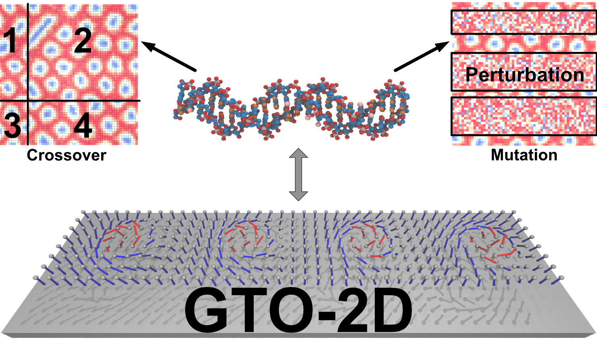
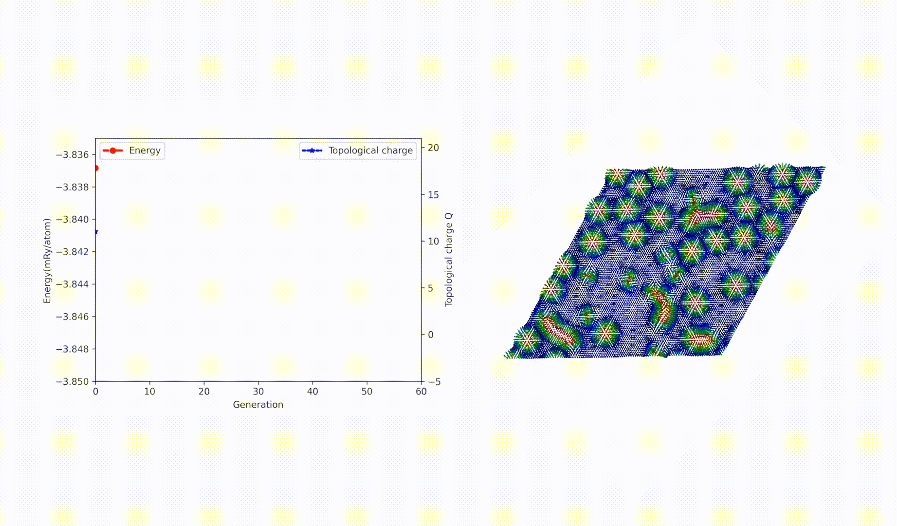
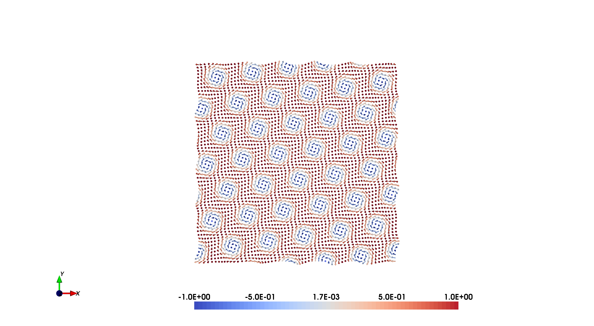

# GTO-2D

## What is GTO-2D

GTO-2D is a metaheuristic optimization package based on genetic tunneling algorithm that designed for finding ground state of complex low-dimensional magnetic systems at finite temperatures. Only magnetic interactions needed to start GTO-2D optimization, no extra prior knowledge or initial guess is needed. The potential user may include but is not limited to scientists that interesting in 2D magnetism. This package currently mainly uses the UppASD backend and accepts DFT-calculated interactions in the same format as UppASD.

The support for Kagome lattice is still in developing.

<p align="center">
  
<p align="justify">

## Cite us

If you used GTO-2D in your research work, we kindly request you condider citing our paper:

Xu, Q., Shen, Z., Pereiro, M., Herman, P., Eriksson, O., & Delin, A. (2022). Genetic-tunneling driven energy optimizer for spin systems. arXiv preprint arXiv:2301.00207.


## Installation
 * First install variance controlled UppASD package `UppASD_VT`:
   ```python
    upzip ./UppASD_VT.zip
    cd ./UppASD_VT
    bash ./setup_UppASD.sh
    make  clean
    make <profile>  
   ```
Where `<profile>` is a suitable compiler profile, i.e. `ifort`, `gfortran`, `gfortran-osx` and so on. More information for install UppASD package can be find in https://uppasd.github.io/UppASD-manual/.

 * Then install `GTO-2D` package:
   ```python
    conda create --name gto2d python=3.10
    conda activate gto2d
    pip install -r Requirements
   ```
 * Testing environment
  ```shell
     1. CentOS 
        Tetralith cluster, National Supercomputer Centre at Linköping University
        CPU: Intel Gold 6130 * 2
        Memory: 96 GB / 384 GB (fat node)
     2. WSL2 in WIN11 (Ubuntu 20.04.5 LTS)
        CPU: Intel i9-12900H
        Memory: 64 GB
     3. openSUSE Tumbleweed x86_64 Kernel: 5.11.12 
        CPU: Intel i9-10850K
        Memory: 64 GB
     4. Mac Mini MacOS 13.1
        CPU: Silicon M1
        Memory: 16 GB
  ```
 ## Case study on Pd/Fe/Ir system with GTO-2D

  With B_ext = 0.7T @ 0.1mK  (Ground state: spin spiral)
 
  <p align="center">
  
  <p align="justify">

  With B_ext = 2.7T @ 0.1mk (Ground state: skyrmion lattice)
 
  <p align="center">
  
  <p align="justify">

  With B_ext = 3.7T @ 0.1mK  (Ground state: ferromagnetic)
 
  <p align="center">
  
  <p align="justify">

## Usage
### Toy demo with Bloch skyrmions
All magentic interaction data are prepared in the same style as UppASD package, more detail on input files can check on:
https://uppasd.github.io/UppASD-manual/

 * Running with prepared JSON input file:
   ```python
   cd ./Example/Toy/
   python ../../GTMCO_2D.py
   ```
    Before execution, please make sure `input_GTO.json` is exsit with all interaction files, it should looks like:
   ```python
    {
        "use_artificial_seed": "False",
        "backend":"UppASD",
        "resource":"Local",
        "generation_range":"50",
        "offspring_nunber":"20",   
        "number_of_random_init_gen":"20", 
        "opmode":"H", 
        "simulate_max_step_seed": "mcNstep  1800",   
        "simulate_max_step_SA": "mcNstep  1800",
        "simulate_max_step_normal": "mcNstep  1800",
        "Elitism_Selection_flag":"True",
        "Elites_number":"10",  
        "Elitism_optimization_flag":"True",    
        "Elitism_optimization_number":"10", 
        "selection_methods":"Steady_State_Selection",   
        "Steady_State_Selection_candidates":"12",   
        "Steady_State_Selection_number":"4",
        "SA_activation":"False",
        "atom_x_size":"60",
        "atom_y_size":"60",
        "atom_number":"3600",
        "GA_variance_threshold":"1e-11",
        "GA_var_threshold_range":"10",
        "multi_factor":"0.5",
        "lattice_parameter":"1.00000   0.00000   0.00000 \n 0.00000   1.00000   0.00000 \n 0.00000   0.00000   1.00000",
        "simulate_temp":"0.0001",
        "applied_field":"0 0 150",
        "threshold_flag": "Y",
        "thresholdsteps": "100",
        "threshold_energy_value": "1e-11",
        "threshold_moment_value": "1e-11",   
        "sd_path": "../../UppASD_VT/bin/sd.gfortran",
        "ridegline_plot_path_generations": "./statistic_result_ridegline.svg" ,
        "ridegline_plot_path_elites": "./elites_result_ridegline.svg"
    }
   ```
  Before running, please check the flga 'sd_path' is setting to the path where you install the UppASD package.


  If everything goes well, one welcome logo will print to the screen:
   ```python

                        ,----,
                      ,/   .`|     ,----..
      ,----..        ,`   .'  :    /   /   \                    ,----,       ,---,
    /   /   \     ;    ;     /   /   .     :                 .'   .' \    .'  .' `\
    |   :     :  .'___,/    ,'   .   /   ;.  \     ,---,.   ,----,'    | ,---.'     \
    .   |  ;. /  |    :     |   .   ;   /  ` ;   ,'  .' |   |    :  .  ; |   |  .`\  |
    .   ; /--`   ;    |.';  ;   ;   |  ; \ ; | ,---.'   ,   ;    |.'  /  :   : |  '  |
    ;   | ;  __  `----'  |  |   |   :  | ; | ' |   |    |   `----'/  ;   |   ' '  ;  :
    |   : |.' .'     '   :  ;   .   |  ' ' ' : :   :  .'      /  ;  /    '   | ;  .  |
    .   | '_.' :     |   |  '   '   ;  \; /  | :   |.'       ;  /  /-,   |   | :  |  '
    '   ; : \  |     '   :  |    \   \  ',  /  `---'        /  /  /.`|   '   : | /  ;
    '   | '/  .'     ;   |.'      ;   :    /              ./__;      :   |   | '` ,/
    |   :    /       '---'         \   \ .'               |   :    .'    ;   :  .'
    \   \ .'                       `---`                 ;   | .'       |   ,.'
      `---`                                               `---'          '---'


    Author: Qichen Xu

    Main Contributors:Qichen Xu, Zhuanglin Shen, Olle Eriksson and Anna Delin.

    Department of Applied Physics, KTH Royal Institute of Technology

    ******************
    Optimization start
    ******************

    Simulated spin system size: 60 * 60
    Simulation temperature: 0.0001K
    Variance threshold: 1e-10 mRy/atom
    Artificial seeds imported
    Local optimization engine: UppASD with threshold implemented by Zhuanglin Shen
    Start broadcasting seeds on potential energy surface
   ```
  When the calculation is done you can visualize the result with tools in UppASD package:
  
  <p align="center">
  
<p align="justify">

  * Running with prepared JSON input and new flags:
    ```python
      python ./1/GTO_2D.py --offspring_nunber 40
    ```
    The GTO-2D will firstly consider values set by flag `--offspring_nunber 40`.
 

  More example, like Pd/Fe/Ir(111) can be find in the "Example" folder. (If you use the interaction data for Pd/Fe/Ir(111), please considering cite the paper: Miranda I P, Klautau A B, Bergman A, et al. Band filling effects on the emergence of magnetic skyrmions: Pd/Fe and Pd/Co bilayers on Ir (111)[J]. https://link.aps.org/doi/10.1103/PhysRevB.105.224413, 2022.)


